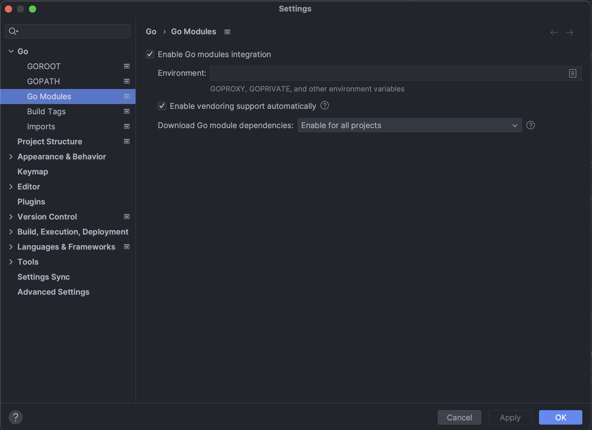

# tch/teamcity-operator


## Getting Started

Download links:

SSH clone URL: ssh://git@git.jetbrains.team/tch/teamcity-operator.git

HTTPS clone URL: https://git.jetbrains.team/tch/teamcity-operator.git


These instructions will get you a copy of the project up and running on your local machine for development and testing purposes.

## Prerequisites
*If this is the first time, opening this project make sure that `go module integration` is enabled.* 

This setting is responsible for automatically downloading go mods specified in `go.mod` file. It's especially useful if lines in `go.mod` are highlighted with red colour.


Required go version:
```
go version go1.20.4
``` 
Required version of minikube. [Instructions for minikube setup](https://minikube.sigs.k8s.io/docs/start/)
```
minikube version: v1.30.1
```
To run locally/debug(configure *minikube* as your current context):
```
minikube start
kubectl config current-context
minikube
```

## Local webhook setup
In 

## Project layout

```
├── api
│   └── v1alpha1 #structs that represent crds. run make generate to generate yaml crds into config/crd/bases folders
├── bin 
│   └── k8s
│       └── 1.26.0-darwin-arm64 #results of make build
├── cmd #contains main.go. operator's entrypoint 
├── config #contains yaml resources for the oeprator to function
│   ├── crd
│   │   ├── bases
│   │   └── patches
│   ├── default
│   ├── manager
│   ├── manifests
│   ├── prometheus #prometheus resources. normally should not be touched
│   ├── rbac #required rbac resources
│   ├── samples #sample yaml resource we can use for testing
│   └── scorecard #olm. normally should not be touched
│       ├── bases
│       └── patches
├── hack #contains boilerplate. normally should not be touched
└── internal #operator's internals
    ├── controller #contains reconciler loop
    ├── metadata #contains functions for building labels and annotations
    └── resource #contains builders for each resource 

25 directories

```
## Run

```shell
make run
```

## Debug
Use run configuration `Run controller` in Run or Debug mode.

***This run configuration assumes minikube is running and context with name `minikube` exists.***

## Test

```shell
make test #finds all test files and runs ginkgo tests
```

## Deployment

```shell
make deploy #installs controller to the selected kube context
```

## Resources

[Project epic](https://youtrack.jetbrains.com/issue/TCI-95/Design-Teamcity-Kubernetes-Operator)

[Project documentation](https://jetbrains.team/p/tch/documents/folders?f=TeamCity-Kubernetes-operator-2UDmNT3mVmsn)

[TeamCity project which tests and builds operator](https://cloud.teamcity.com/project/DeploymentManagement_Shared_TeamCityOperator)


